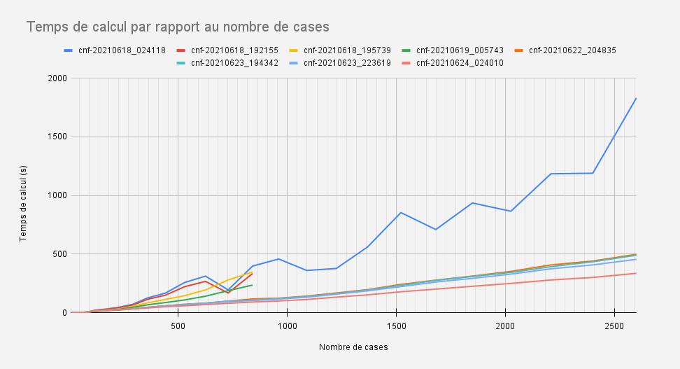

# IA02-Projet

Projet dans le cadre de l'UV IA02 "Logique et Résolution de problèmes par la recherche" de l'Université de Technologie de Compiègne.
Résolution d'un problème style démineur.


## Copier le projet

- `git clone https://gitlab.utc.fr/branlyst/ia02-projet.git`

## Quelques infos dans le tas :

- [Sujet du projet](https://hackmd.io/@ia02/By_zb5GFd)
- Pour coder, 
    - essayer au maximum de typer (ex: `from Typing import Dict`, `def test(a: str) -> Dict: ...` ), utiliser `mypy` pour vérifier : 
    ``` mypy **.py ./joueur/*.py ./moteur/*.py ./test/*.py ./types_perso/*.py```
    - utiliser le snake_case avec des noms concis pour les variables, et des verbes pour les fonctions (ex: `ma_variable`, `verifier_carte()`)
    - utiliser `black` pour avoir un code propre visuellement (indentation, ...)
    - utiliser si possible sur VS Code l'extension UTC-Header [github extension](https://github.com/StephaneBranly/vscode-utc-header)

## TO DO 
- [x] voir le fonctionnement de l'API
- [x] faire en sorte que l'on peut effectuer des tests facilement sur une multitude de maps créées en local
- [x] etudier la parallelisation / creation de `thread` -> pas efficace
- [x] tester en cnf pour comparer les performances -> on conserve `cnf`
- [x] effectuer un test en priorite sur le type d'animal le plus present sur le reste de la map `(T,S,C,R)` => R pour rien
- [x] avant test final, retirer les commentaires dans le fichier
- [ ] retirer clauses en double
- [x] retirer variable inutilisee

## Structuration du projet
```
projet/ 
|-- main.py
|-- joueur/ 
|       |-- joueur.py
|       |-- joueur_parallele.py
|       |-- solver_template.py
|       |-- dimacs.py
|       |-- pseudo_boolean.py
|       |-- fichiers_cnf/
|       |-- fichiers_opb/
|
|-- moteur/ 
|       |-- moteur.py
|       |-- crocomine_client.py
|       |-- serveur/
|
|-- test/ 
|       |-- test.py
|       |-- generer_cartes.py
|       |-- test_maps/
|       |-- historique_maps/
|
|-- grilles/ 
|       |-- croco/
|       |-- map/
|
|-- types_perso/ 
|       |-- types_perso.py
|
|-- solvers/                    
```

## Exécution des tests
Dans le dossier `./test/` se trouvent les outils utilisés pour effectuer les tests. 
- On retrouve un générateur de cartes dont on pourra modifier certains paramètres comme `n`, `m`, la `proportion d'eau` et la `proportion d'animaux`. La case de départ est toujours libre d'animaux ainsi que son voisinage.
- Nous avons aussi une fonction de test exécutant toutes les cartes du `serveur local` ou du `moteur local` (moteur implémenté avant l'apparition de la première version du serveur) et indiquant des statistiques relatives aux parties comme le résultat de la carte (`OK`|`KO`), le temps pour la résoudre, la donnée `s` correspondant à la sureté des coups joués (`s=1.00` signifie que tous les coups étaient certains, pour `s < 1` on a des coups qui ont été selectionnés par des probabilités). 
- Une comparaison des temps d'exécution a été réalisé afin d'évaluer la qualité des optimisations. Cette comparaison est faite sur une carte de `51x51` avec le point de départ au centre. Un `zoom` est effectué sur cette carte pour comparer les performances en fonction de la taille.


## Optimisations
- Gestion du fichier
    - Lecture limitée au strict minimum
    - Edition en `append` quand possible (pour éviter de devoir tout réécrire) 
    - Sauvegarde de la position du curseur pour tester et modifier les hypothèses (non parallèle)
- Sélection des cases à tester
    - Les cases ayant recues les dernieres informations sont testées en priorité (non parallèle)
- Test des hypothèses sur une case
    - Test uniquement si le terrain est cohérent avec l'animal de l'hypothèse
    - Test uniquement s'il reste encore sur la carte l'animal de l'hypothèse
    - Tests effectués en parallèle
- Modélisation du problème
    - Utilisation de seulement 3 variables par cellule `(Croco, Tigre, Requin)`
- Solveur SAT
    - Utilisation de `Glucose` au lieu de `Gophersat` (indiqué comme 2 à 5 fois plus rapide)
        - Glucose personnalisé dispo ici : [glucose-syrup-4.1](https://github.com/StephaneBranly/glucose-syrup-4.1)
    - Recompilation du solveur en changeant le contenu de `stdout` (`0`|`1`|`2` au lieu de `s UNSATISFIABLE`|`s SATISFIABLE` + informations superflux)
    - Recompilation du solveur pour changer les arguments : `solver fichier.cnf nb_vars nb_clauses "clause a tester"` (parallèle)


## Comparaison des performances

Informations sur les courbes:
| Nom courbe  | Amélioration apportée |
| ------------- | ------------- |
| cnf-20210618_024118 | version initiale aux tests de performances |
| cnf-20210618_192155 | changement ordre priorite des tests |
| cnf-20210618_195739 | guess effectues a la toute fin |
| cnf-20210619_005743 | utilisation de glucose-simp recompile en changeant l'output |
| cnf-20210622_204835 | meilleure gestion de la liste des cases a tester |
| cnf-20210623_194342 | nombre de variable passe a 3 / pour cnf |
| cnf-20210623_223619 | recompilation de glucose pour utiliser des arguments |
| cnf-20210624_024010 | parallelisation |


